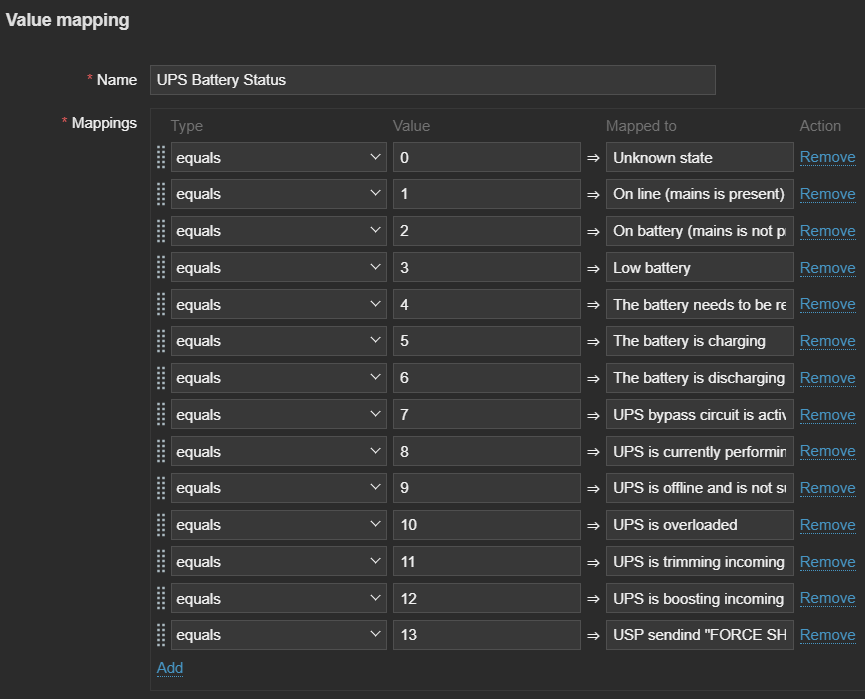

# Zabbix NUT Template

## Overview  

Original repository: https://github.com/delin/Zabbix-NUT-Template  
This is the modified version we use with our equipment. Feel free to disable/delete unnesessary triggers. Added graphs for *charge*, *input frequency*, *load*, *temperature* and *input/output voltage*.

## Requirements

Zabbix version: 6.2 and higher.

## Configuration

> Zabbix should be configured according to the instructions in the [Templates out of the box](https://www.zabbix.com/documentation/current/en/manual/config/templates_out_of_the_box) section


## Setup

### Host side

- Download and install NUT according your equipment and needs <br>https://networkupstools.org/download.html <br>
https://networkupstools.org/docs/user-manual.chunked/index.html <br>
https://wiki.ipfire.org/addons/nut/detailed <br>
- install zabbix-agent
- copy `userparameter_nut.conf` from `zabbix-agentd.d` in this repository to `/etc/zabbix/zabbix-agentd.d/` on your monitored host
- create directory `/etc/zabbix/sh/` and copy there `ups_status.sh` from `sh` directory in this repository
- fix permissions of the script
```sh
chmod +x /etc/zabbix/sh/*
```
- restart zabbix-agent
```
systemctl restart zabbix-agent
```

### Zabbix server side

- Import the template NUT-UPS-{\$version}.yaml where {\$version} is your zabbix server version.
- Make sure the template has properly configured value mapping or adjust it according your hardware (feel free to modify `ups_status.sh` aswell)<br>
 <br>
- Attach it to needed host which needs to be monitored

### Macros used


|Name|Description|Default|
|----|-----------|-------|
|`{$UPS.TEMPERATURE.CRIT}`|UPS critical temperature (may vary of specific UPS models)|`35`|


### LLD rule **UPS Discovery**

|Name|Description|Type|Key and additional info|
|----|-----------|----|-----------------------|
|UPS Discovery|Basic UPS discovery rule|Zabbix agent|upsmon[ups.discovery]|

### Item prototypes for **UPS Discovery**

|Name|Description|Type|Key and additional info|
|----|-----------|----|-----------------------|
|UPS {#UPSNAME} Charge| |Discovery|upsmon[{#UPSNAME},battery.charge]|
|UPS {#UPSNAME} Battery Voltage| |Discovery|upsmon[{#UPSNAME},battery.voltage]|
|UPS {#UPSNAME} Input Frequency| |Discovery|upsmon[{#UPSNAME},input.frequency]|
|UPS {#UPSNAME} Input Voltage| |Discovery|upsmon[{#UPSNAME},input.voltage]|
|UPS {#UPSNAME} Output Voltage| |Discovery|upsmon[{#UPSNAME},output.voltage]|
|UPS {#UPSNAME} Load| |Discovery|upsmon[{#UPSNAME},ups.load]|
|UPS {#UPSNAME} Status|UPS status with various meanings from On line to Unknown state, including battery status and voltage levels.|Discovery|upsmon[{#UPSNAME},ups.status]|
|UPS {#UPSNAME} Temperature| |Discovery|upsmon[{#UPSNAME},ups.temperature]|

---

### Trigger prototypes for **UPS Discovery**

|Name|Description|Expression|Severity|Dependencies and additional info|
|----|-----------|----------|--------|--------------------------------|
|UPS {#UPSNAME} Charge < 10%| |avg(/UPS-NUT/upsmon[{#UPSNAME},battery.charge],2m)<10|Disaster|**Depends on:**<br>UPS-NUT: UPS {#UPSNAME} Status - Offline|
|UPS {#UPSNAME} Charge < 20%| |avg(/UPS-NUT/upsmon[{#UPSNAME},battery.charge],2m)<20|Disaster|**Depends on:**<br>UPS-NUT: UPS {#UPSNAME} Status - Offline|
|UPS {#UPSNAME} Charge < 30%| |avg(/UPS-NUT/upsmon[{#UPSNAME},battery.charge],2m)<30|Disaster|**Depends on:**<br>UPS-NUT: UPS {#UPSNAME} Status - Offline|
|UPS {#UPSNAME} Charge < 40%| |avg(/UPS-NUT/upsmon[{#UPSNAME},battery.charge],2m)<40|Disaster|**Depends on:**<br>UPS-NUT: UPS {#UPSNAME} Status - Offline|
|UPS {#UPSNAME} Charge < 50%| |avg(/UPS-NUT/upsmon[{#UPSNAME},battery.charge],2m)<50|High|**Depends on:**<br>UPS-NUT: UPS {#UPSNAME} Status - Offline|
|UPS {#UPSNAME} Charge < 60%| |avg(/UPS-NUT/upsmon[{#UPSNAME},battery.charge],2m)<60|High|**Depends on:**<br>UPS-NUT: UPS {#UPSNAME} Status - Offline|
|UPS {#UPSNAME} Charge < 70%| |avg(/UPS-NUT/upsmon[{#UPSNAME},battery.charge],2m)<70|High|**Depends on:**<br>UPS-NUT: UPS {#UPSNAME} Status - Offline|
|UPS {#UPSNAME} Charge < 80%| |avg(/UPS-NUT/upsmon[{#UPSNAME},battery.charge],2m)<80|High|**Depends on:**<br>UPS-NUT: UPS {#UPSNAME} Status - Offline|
|UPS {#UPSNAME} Charge < 90%| |avg(/UPS-NUT/upsmon[{#UPSNAME},battery.charge],2m)<90|High|**Depends on:**<br>UPS-NUT: UPS {#UPSNAME} Status - Offline|
|UPS {#UPSNAME} Status - Unknown state|Unknown state|last(/UPS-NUT/upsmon[{#UPSNAME},ups.status])=0|Disaster| |
|UPS {#UPSNAME} Status - On battery|On battery (mains is absent)|last(/UPS-NUT/upsmon[{#UPSNAME},ups.status])=2|High| |
|UPS {#UPSNAME} Status - Low battery|Low battery|last(/UPS-NUT/upsmon[{#UPSNAME},ups.status])=3|Disaster| |
|UPS {#UPSNAME} Status -The battery needs to be replaced|The battery needs to be replaced|last(/UPS-NUT/upsmon[{#UPSNAME},ups.status])=4|High| |
|UPS {#UPSNAME} Status - Battery is charging|The battery is charging|last(/UPS-NUT/upsmon[{#UPSNAME},ups.status])=5|Info| |
|UPS {#UPSNAME} Status - battery is discharging (inverter is providing load power)|The battery is discharging (inverter is providing load power)|last(/UPS-NUT/upsmon[{#UPSNAME},ups.status])=6|Warning| |
|UPS {#UPSNAME} Status - Bypass|UPS bypass circuit is active echo no battery protection is available|last(/UPS-NUT/upsmon[{#UPSNAME},ups.status])=7|Disaster| |
|UPS {#UPSNAME} Status - Calibration|UPS is currently performing runtime calibration (on battery)|last(/UPS-NUT/upsmon[{#UPSNAME},ups.status])=8|Info| |
|UPS {#UPSNAME} Status - Offline|UPS is offline and is not supplying power to the load|last(/UPS-NUT/upsmon[{#UPSNAME},ups.status])=9|Disaster| |
|UPS {#UPSNAME} Status - Overloaded|UPS is overloaded|last(/UPS-NUT/upsmon[{#UPSNAME},ups.status])=10|Disaster| |
|UPS {#UPSNAME} Status - Trimming incoming voltage|UPS is trimming incoming voltage (called "buck" in some hardware)|last(/UPS-NUT/upsmon[{#UPSNAME},ups.status])=11|High| |
|UPS {#UPSNAME} Status - Boosting incoming voltage|UPS is boosting incoming voltage|last(/UPS-NUT/upsmon[{#UPSNAME},ups.status])=12|High| |
|UPS {#UPSNAME} Status - FORCE SHUTDOWN|UPS sending FORCE SHUTDOWN|last(/UPS-NUT/upsmon[{#UPSNAME},ups.status])=13|Disaster| |
|UPS {#UPSNAME} Status - Online with Bypass|UPS bypass circuit is active echo no battery protection is available in Online state|last(/UPS-NUT/upsmon[{#UPSNAME},ups.status])=14|High| |
| UPS {#UPSNAME} Temperature|UPS temperature over threshold|last(/UPS-NUT/upsmon[{#UPSNAME},ups.temperature])>{$UPS.TEMPERATURE.CRIT}|High| |
